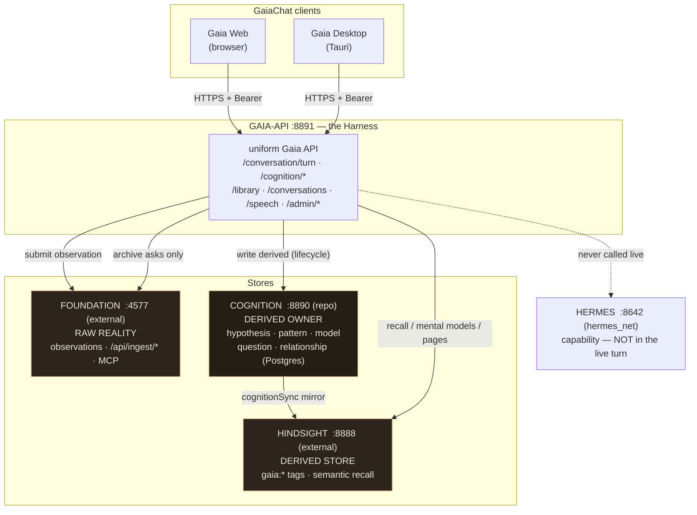
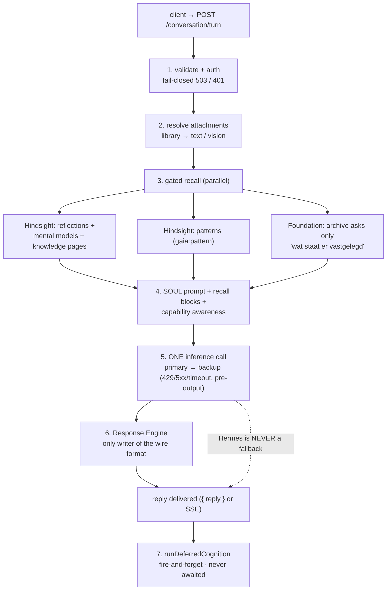
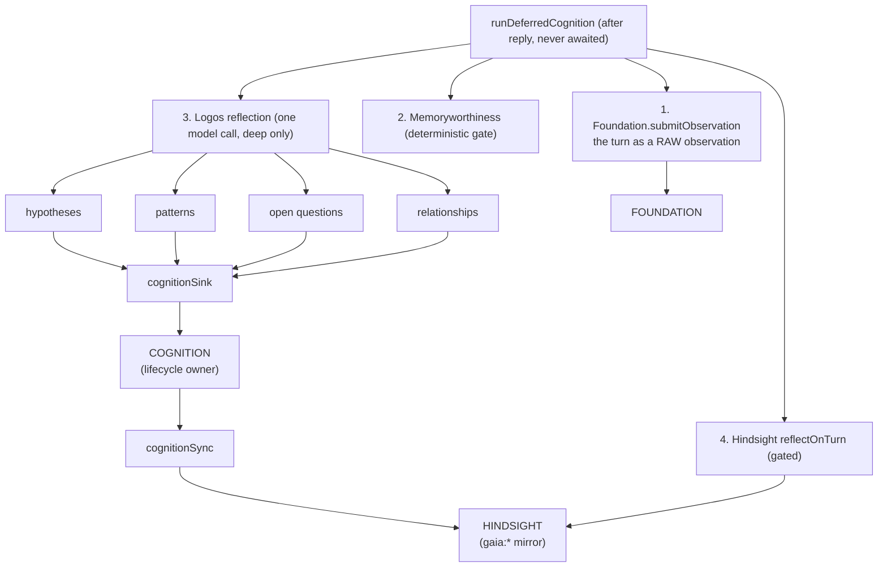
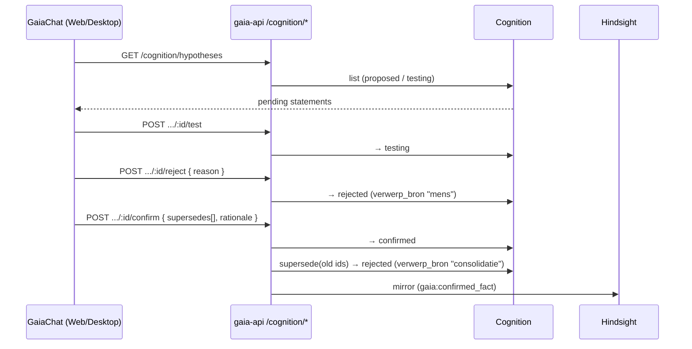
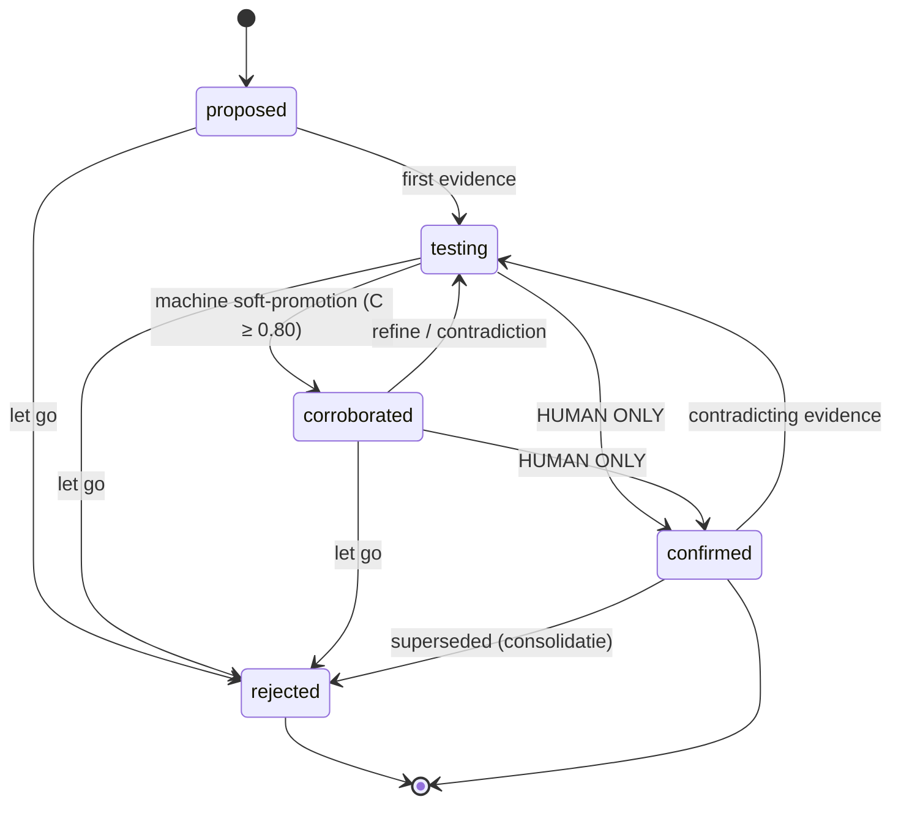
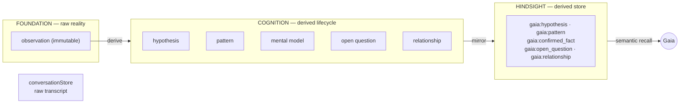

# Gaia-Cloud — how everything is connected

A visual map of the current system: the three stores, the live turn, the
deferred cognition that writes, and the human Absolute Override.

> Renders on GitHub natively (Mermaid). A standalone, zoomable version lives in
> `docs/architecture-graph.html`.

## 1. The whole system

## 2. The live turn — direct generation

## 3. Deferred cognition — where writing happens

## 4. Human Absolute Override — the only path to `confirmed`

## 5. The lifecycle

## 6. What lives where

## The three boundaries

1. **Foundation = raw reality.** A client that claims a `status` is refused (422). Observations only.
2. **Cognition = the lifecycle owner.** It stores and books transitions; it never reasons. Logos proposes, the human confirms.
3. **Hindsight = the derived store.** Rebuildable from Cognition with provenance; recall lives here because Cognition has no vector search.
